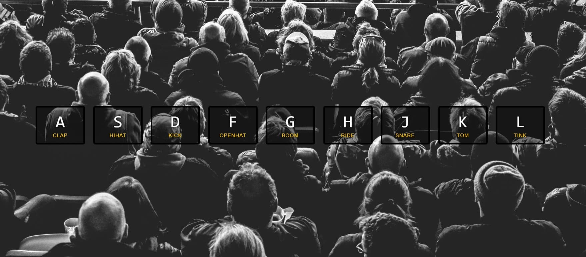

# Javascript Drum Kit

Первый проект в **#Javascript30** челлендже от [Wes Bos](https://wesbos.com).

## Что такое:

Виртуальный барабан играющий соответствующий звук по нажатию на клавишу клавиатуры.

### Что я сделал:

Написал JS код реализующий задумку проекта.

---

Работая над ним я пошел по несколько более сложному, но надеюсь более эффективному пути, чем это предлагалось в эталонном варианте.

Ключевым отличием является создание объекта который будет включать элементы и звуки по ключу, чтобы не приходилось при каждом клике искать нужный в DOM, как предлагалось в финальном варианте. Также добавил свойства `transition-property` и `will-change` для лучшей производительности.

Ах да. Узнал о событии transitionend. Супер-полезная штука.